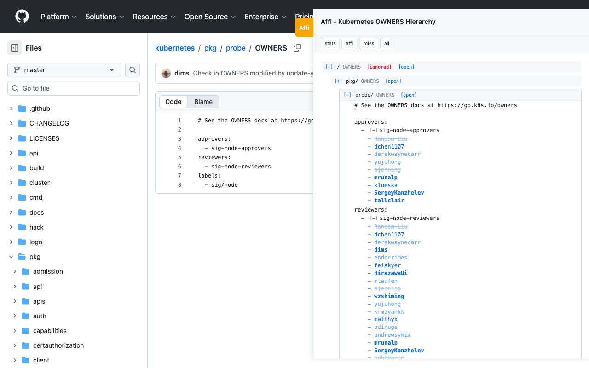
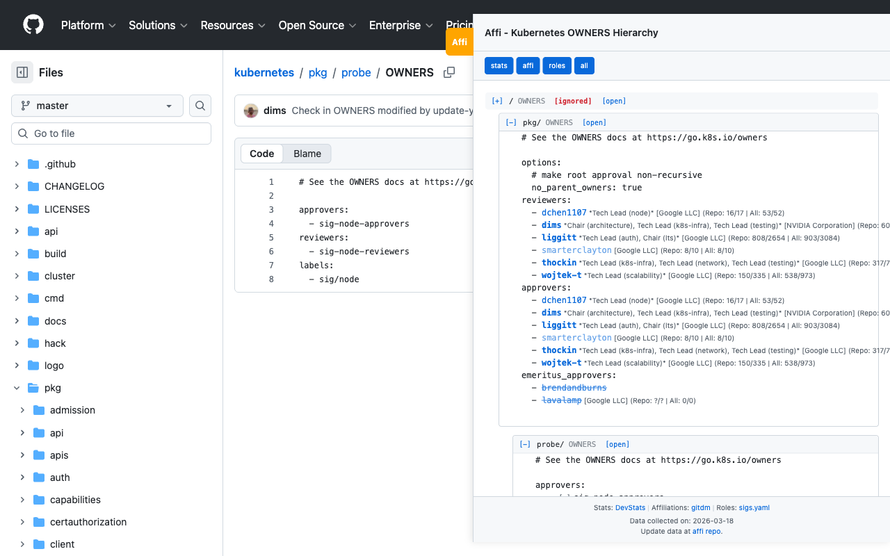

# Affi - Kubernetes OWNERS Hierarchy & Stats

- [Available on the Chrome Web Store](https://chromewebstore.google.com/detail/affi/fflpjbbjhlededagabjhaodefilblglg?pli=1)
- [Available on Firefox Add-ons](https://addons.mozilla.org/en-US/firefox/addon/affi/) (Link TBD - In Review)

Affi is a browser extension designed for Kubernetes developers and maintainers.
 It provides an interactive overlay when viewing `OWNERS` and `OWNERS_ALIASES` files on GitHub, making it easier to understand maintainer hierarchies and contribution activity.

### Default View


### All Stats & Features


## Features

- **Hierarchical OWNERS View:** Automatically traverses from the repository root down to the current directory to show all relevant `OWNERS` files.
- **Intelligent Truncation:** Respects the `no_parent_owners: true` flag by visually marking ancestor folders as `[ignored]`, providing a clear view of which files actually contribute to the current directory's ownership.
- **Interactive Alias Expansion:** Resolves aliases using the `OWNERS_ALIASES` file and allows expanding them into a list of GitHub handles with one click.
- **Contributor Activity Stats:** Toggleable statistics for individual maintainers, showing both repository-specific and global (across all Kubernetes repos) activity.
- **Visual Engagement Cues:** Intuitively identifies active, low-activity, and completely inactive maintainers based on PR comments and DevStats scores.
- **Direct GitHub Links:** Every maintainer handle is a clickable link to their GitHub profile.
- **Company Affiliations & Roles:** Displays company affiliations and official Kubernetes community roles (e.g., SIG Chairs, Tech Leads) directly next to maintainer handles.
- **Customizable Visibility:** Toggleable buttons allow you to show or hide stats, affiliations, and roles to suit your workflow.

## Data Sources

The extension uses a pre-generated database (`maintainers_stats.json`) derived from several authoritative sources:
- **Contribution Stats:** Aggregated activity from all repositories in the `kubernetes` and `kubernetes-sigs` organizations. Generated using the [maintainers](https://github.com/dims/maintainers) tool, which retrieves data from [K8s DevStats](https://k8s.devstats.cncf.io).
- **Company Affiliations:** Derived from the [CNCF gitdm](https://github.com/cncf/gitdm) (Developer Data Miner) project.
- **Community Roles:** Extracted from the official Kubernetes [sigs.yaml](https://github.com/kubernetes/community/blob/master/sigs.yaml).

## Privacy & Performance

All information displayed by the extension (statistics, affiliations, and roles) is **static** and bundled directly within the extension. No external API calls are made to GitHub, CNCF, or DevStats during use. To ensure you have the most up-to-date data, please keep the extension updated to the latest version. See [PRIVACY.md](PRIVACY.md) for more details.

## Project Structure

- `content.js`: Core extension logic for DOM manipulation and navigation handling.
- `ui.js`: Modular logic for rendering the interactive tree overlay.
- `parser.js`: Modular logic for parsing `OWNERS` YAML and individual line analysis.
- `firefox/`: Contains the Firefox-specific manifest source.
- `generate_stats.py`: A Python pipeline that uses the `maintainers` Go tool to build the activity database.
- `maintainers_stats.json`: The generated JSON database containing activity metrics for the Kubernetes ecosystem.
- `tests/`: A comprehensive Jest-based unit test suite and E2E test page.
- `Makefile`: Streamlined targets for building, syncing, and testing.

## Installation (Developer Mode)

### Chrome
1. Clone this repository.
2. Open Chrome and navigate to `chrome://extensions/`.
3. Enable **Developer mode** (toggle in the top right).
4. Click **Load unpacked** and select the project directory.

### Firefox
1. Clone this repository.
2. Run `make sync-firefox` to prepare the `firefox/` directory.
3. Open Firefox and navigate to `about:debugging`.
4. Click **This Firefox** in the sidebar.
5. Click **Load Temporary Add-on...** and select `firefox/manifest.json`.

## Statistics Generation

To update the maintainer statistics database:

1. Ensure you have [Go](https://go.dev/) and [Python 3](https://www.python.org/) installed.
2. Run `make generate-stats` to fetch and parse data for all Kubernetes and kubernetes-sigs repositories.
3. Refresh the extension in Chrome.

## Testing

The project uses Jest for unit testing. To run the tests:

```bash
make test
```

## Contributing

Contributions are welcome! Please ensure that all new features include corresponding unit tests and that `make test` passes before submitting a PR.

## License

MIT
